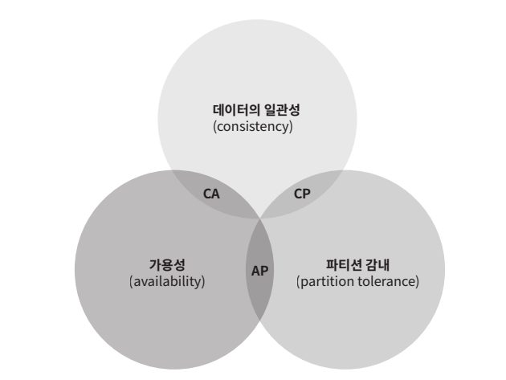
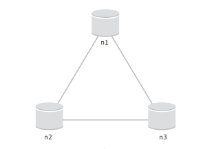

# 키-값 저장소 설계

키-값 저장소는 키-값 데이터베이스라고도 불리는 비 관계형 데이터베이스이다. 이 저장소에 저장되는 값은 고유 식별자를 키로 가져야 한다. 키과 값 사이의 이런 연결 관계를 "키-값" 쌍이라고 지칭한다.

키-값 쌍에서 키는 유일해야 하며 해당 키에 매칭되는 값은 키를 통해서만 접근할 수 있다. 키는 일반 텍스트일 수도 있고 해시 값일 수도 있다. 성능 상의 이유로 키는 짧을수록 좋다.

키-값 쌍에서 값은 문자열일 수도 있고 리스트일 수도 있고 객체일 수도 있다. 키-값 저장소로 널리 알려진 것으로는 아마존 다이나모, memcached, 레디스 등이 있다. 

키-값 저장소는 다음 연산을 지원한다.

- put(key, value) : 키-값 쌍을 저장소에 저장한다.
- get(key) : 인자로 주어진 키와 매칭되는 값을 꺼낸다.

 

## 단일 서버 키-값 저장소

한 대 서버만 사용하는 키-값 저장소를 설계하는 가장 직관적인 방법은 키-값 쌍 전부를 메모리에 해시 테이블로 저장하는 것이다. 그러나 이렇게 하면 속도는 빠르지만, 모든 데이터를 메모리 안에 두는 것이 불가능할 수도 있다. 이 문제를 해결하기 위한 개선책으로는 다음과 같은 것이 있다.

- 데이터 압축
- 자주 쓰이는 데이터만 메모리에 두고 나머지는 디스크에 저장

그러나 개선한다고 해도 서버 한 대로는 부족한 때가 찾아오기 때문에 많은 데이터를 저장하기 위해서는 분산 키-값 저장소를 만들어야 한다.

 

## 분산 키-값 저장소

분산 키-값 저장소는 분산 해시 테이블이라고도 불린다. 키-값 쌍을 여러 서버에 분산시키기 때문이다. 분산 시스템을 설계할 때는 CAP 정리(Consistency, Availability, Partition Tolerance theorem)를 이해하고 있어야 한다.

 

### CAP 정리

CAP 정리는 데이터 일관성, 가용성, 파티션 감내하는 세 가지 요구사항을 동시에 만족하는 분산 시스템을 설계하는 것은 불가능하다는 정리이다.

- 데이터 일관성 : 분산 시스템에 접속하는 모든 클라이언트는 어떤 노드에 접속했느냐에 관계없이 언제나 같은 데이터를 보게 되어야 한다.
- 가용성 : 분산 시스템에 접속하는 모든 클라이언트들은 일부 노드에 장애가 발생하더라도 항상 응답을 받을 수 있어야 한다.
- 파티션 감내 : 파티션은 두 노드 사이에 통신 장애가 발생하였음을 의미한다. 파티션 감내는 네트워크에 파티션이 생기더라도 시스템은 계속 동작하여야 한다는 것을 뜻한다.

 

위 요구사항 가운데 어떤 두 가지를 충족하면 다음 사진과 같이 나머지 하나는 반드시 희생되어야 한다.

키-값 저장소는 앞서 제시한 세 가지 요구사항 가운데 어느 두 가지를 만족하느냐에 따라 다음과 같이 분류할 수 있다.

- CP 시스템 : 일관성과 파티션 감내를 지원하는 키-값 저장소로 가용성을 희생
- AP 시스템 : 가용성과 파티션 감내를 지원하는 키-값 저장소로 데이터 일관성을 희생
- CA 시스템 : 일관성과 가용성을 지원하는 키-값 저장소로 파티션 감내는 지원하지 않음

통상 네트워크 장애는 피할 수 없는 일이기 때문에 분산 시스템은 반스시 파티션 문제를 감내할 수 있도록 설계되어야 한다. 따라서 실제로 CA 시스템은 존재하지 않는다.

 

#### CA 시스템이 존재하지 않는 사례

분산 시스템에서 데이터는 보통 여러 노드에 복제되어 보관된다. 다음은 세 대의 노드에 데이터를 복제하여 보관하는 상황이다.

 

이상적 환경인 경우에는 네트워크가 파티션 되는 상황이 발생하지 않는다. n1에 기록된 데이터는 자동적으로 n2와 n3에 복제되고, 데이터의 일관성과 가용성도 만족된다.

하지만 실세계의 분산 시스템은 파티션 문제를 피할 수 없다. 파티션 문제가 발생하면 일관성과 가용성 중에 하나를 선택하여야 한다. 만약 n3에 장애가 생겨 n1, n2와 통신할 수 없는 경우 n1 또는 n2에 기록한 데이터는 n3에 전달되지 않는다. 또한 n3에 기록되었으나 아직 n1 또는 n2로 전달되지 않는 데이터가 있는 경우 n1과 n2는 해당 데이터를 가질 수 없다.

- 일관성 선택 (CP 시스템) : 세 서버 사이에 생길 수 있는 데이터 불일치 문제를 피하기 위해 n1과 n2에 대한 쓰기 연산을 중단시켜야 한다. 하지만 쓰디 연산을 중단하는 경우 가용성이 깨진다. 네트워크 파티션 때문에 일관성이 깨질 수 있는 상황이 발생하면 이런 시스템은 상황이 해결될 때까지는 오류를 반환해야 한다.
- 가용성 선택 (AP 시스템) : 오래된 데이터를 반환할 위험이 있더라도 게속 읽기 연산을 허용해야 한다. n1과 n2는 계속 쓰기 연산을 허용할 것이고, 파티션 문제가 해결된 후 새로운 데이터를 n3에 전송할 것이다.

 

분산 키-값 저장소를 만들 때는 그 요구사항에 맞도록 CAP 정리를 적용해야 한다.

 

### 시스템 컴포넌트

#### 데이터 파티션

데이터를 파티션 단위로 나눌 떄는 다음 두 가지 문제를 중요하게 따져야 한다.

- 데이터를 여러 서버에 고르게 분산할 수 있는가.
- 노드가 추가되거나 삭제될 때 데이터의 이동을 최소화할 수 있는가.

안정 해시는 이런 문제들을 푸는 데 적합한 기술이다.

 

안정 해시를 이용하여 제이터를 파티션하면 좋은 점은 다음과 같다.

- 규모 확장 자동화 : 시스템 부하에 따라 서버가 자동으로 추가되거나 삭제되도록 만들 수 있다.

- 다양성 : 각 서버의 용량에 맞게 가상 노드의 수를 조정할 수 있다.

  
