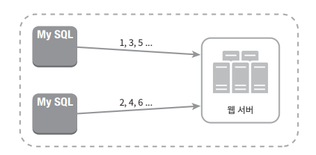

# 분산 시스템을 위한 유일 ID 생성기 설계

'auto_increment' 속성이 설정된 관계형 DB의 기본 키의 경우 분산 환경에서 사용하면 지연 시간을 낮추기가 매우 어렵다. 따라서 분산 시스템에서 유일 ID를 사용하려면 별도의 설계가 필요하다.

 

## 설계 요구사항

- ID는 유일해야 한다.
- ID는 숫자로만 구성되어야 한다.
- ID는 64비트로 표현될 수 있는 값이어야 한다.
- ID는 발급 날짜에 따라 정렬 가능해야 한다.
- 초당 10000개의 ID를 만들 수 있어야 한다.

 

## 다중 마스터 복제

다중 마스터 복제는 다음과 같은 구성을 가진다.

다중 마스터 복제는 데이터베이스의 auto_increment 기능을 활용하여 
